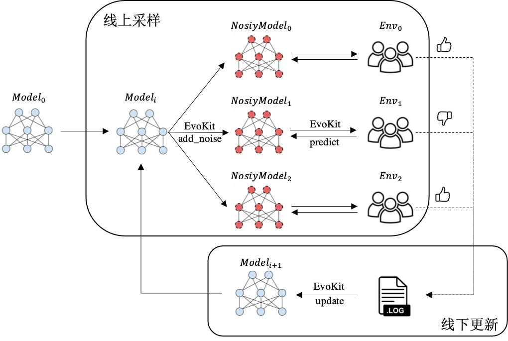

# EvoKit

 `EvoKit` 是一个集合了多种进化算法、可兼容不同预测框架的进化算法库，主打**快速上线验证**。  
目前，`EvoKit` 基于 [Paddle Lite](https://www.paddlepaddle.org.cn/paddle/paddlelite) 飞桨推理引擎实现了基于进化算法的**线上采样**和**线下更新**的一站式上线流程。

## 使用场景
- 想要基于进化算法对**线上模型**进行黑盒优化（例如优化目标对模型不可导场景）;
- 想快速调研**不同进化算法**在同一个问题上的效果。

## EvoKit文档全览
<table>
  <tbody>
    <tr align="center" valign="bottom">
      <td>
        <b>算法支持</b>
        
      </td>
      <td>
        <b>示例</b>
        
      </td>
      <td>
        <b>用户接口</b>
        
      </td>
    </tr>
    </tr>
    <tr valign="top">
      <td>
        <ul>
        <li><b>进化算法</b></li>
           <ul>
          <li><a href="algorithms/ES.md">ES</a></li>
          <li><a href="algorithms/CMA-ES.md">CMA-ES</a></li>
          <li><a href="algorithms/GA.md">GA</a></li>
           </ul>
        </ul>
        <ul>
        <li><b>优化器</b></li>
           <ul>
          <li><a href="algorithms/SGD.md">SGD</a></li>
          <li><a href="algorithms/Momentum.md">Momentum</a></li>
          <li><a href="algorithms/Adam.md">Adam</a></li>
           </ul>
        </ul>
        <ul>
        <li><b>更新机制</b></li>
           <ul>
          <li><a href="algorithms/sync_update.md">同步</a></li>
          <li><a href="algorithms/async_update.md">异步</a></li>
           </ul>
        </ul>
      </td>
      <td align="left" >
        <ul>
            <li><b>基础示例</b></li>
            <ul>
              <li><a href="examples/Cartpole.md">Cartpole</a></li>
              <li><a href="examples/Boston.md">Boston</a></li>
              <li><a href="examples/MovieLens.md">MovieLens</a></li>
            </ul>
        </ul>
        <ul>
            <li><b>线上模拟示例</b></li>
            <ul>
              <li><a href="examples/sync_online_example.md">同步更新</a></li>
              <li><a href="examples/async_online_example.md">异步更新</a></li>
            </ul>
        </ul>
      </td>
      <td>
        <ul>
            <li><b><a href="APIs/config.md">配置文件</a></b></li>
        </ul>
        <ul>
            <li><b>函数接口</b></li>
            <ul>
            <li><a href="APIs/ESAgent.md">ESAgent</a></li>
            <li><a href="APIs/AsyncESAgent.md">AsyncESAgent</a></li>
            <li><a href="APIs/SamplingInfo.md">SamplingInfo</a></li>
            </ul>
        </ul>
      </td>
    </tr>
  </tbody>
  
</table>

## 讨论
- 【通用】在GitHub上[提交问题](https://github.com/PaddlePaddle/PARL/issues)
- 【内部】百度Hi讨论群：21794605
