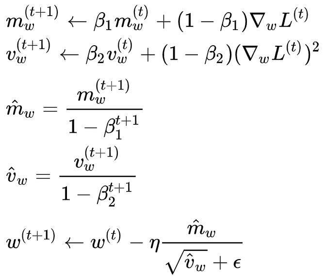

# Adam
Adam (Adaptive Moment Estimation) 优化器是RMSProp优化器的一个升级，它利用梯度的一阶矩估计和二阶矩估计动态调整每个参数的学习率。具体公式如下：

<p align="center">

</p>

## 如何使用
在EvoKit中使用Adam优化器，需要在配置文件的`solver`中，将`optimizer`的`type`字段设为`Adam`，并配置相关参数，如下面`config.prototxt`所示：
```
solver {
    type: BASIC_ES
    sampling {
        ...
    }
    optimizer {
        type: ADAM
        base_lr: 0.05
        adam {
            beta1: 0.9
            beta2: 0.999
            epsilon: 1e-08
        }
    }
    reward_normalizer {
        ...
    }
}
```

### ADAM optimizer参数
- `base_lr`: 学习率
- `adam`
  - `beta1`：一阶矩估计的指数衰减率，默认值为0.9；
  - `beta2`：二阶矩估计的指数衰减率，默认值为0.999；
  - `epsilon`：用于数值稳定，默认值为1e-8。

## 参考
[Adam - Wikipedia](https://en.wikipedia.org/wiki/Stochastic_gradient_descent#Adam)
