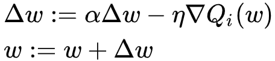

# Momentum
Momentum优化器是带动量的SGD优化器，相比SGD可以加速收敛和减小震荡，其参数更新由梯度和上一次更新线性组合得到，具体公式如下：

<p align="center">

</p>

## 如何使用
在EvoKit中使用Momentum优化器，需要在配置文件的`solver`中，将`optimizer`的`type`字段设为`MOMENTUM`，如下面`config.prototxt`所示：
```
solver {
    type: BASIC_ES
    sampling {
        ...
    }
    optimizer {
        type: MOMENTUM
        base_lr: 0.5
        momentum {
            momentum: 0.9
        }
    }
    reward_normalizer {
        ...
    }
}
```

### MOMENTUM optimizer参数
- `base_lr`: 学习率
- `momentum`
  - `momentum`: 数值在0和1之间的指数衰减因子，决定梯度和上一次更新之间的更新权重，默认值为0.9（如果为0则等价于SGD）。

## 参考
[Momentum - Wikipedia](https://en.wikipedia.org/wiki/Stochastic_gradient_descent#Momentum)
